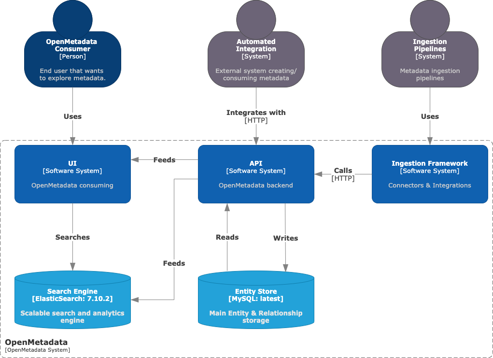
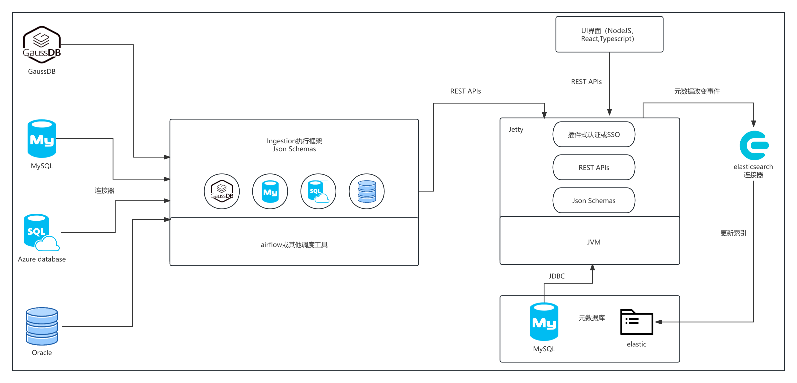
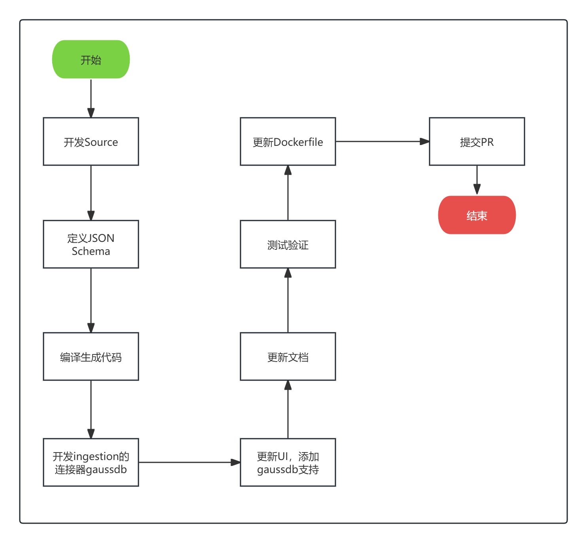

# Openmetadata介绍

## 开源地址

在github的开源地址: [Openmetadata](https://github.com/open-metadata/OpenMetadata.git)

## 什么是Openmetadata?

`Openmetadata` 是一个用于数据发现、数据可观测性和数据治理的统一元数据平台，由中央元数据存储库、深入的列级沿袭和无缝团队协作提供支持。它是发展最快的开源项目之一，拥有充满活力的社区，并被各种垂直行业的各种公司采用。OpenMetadata 基于开放元数据标准和 API，支持各种数据服务的连接器，支持端到端元数据管理，让您可以自由释放数据资产的价值。

`Openmetadata` 由四个主要组件组成：

- 元数据架构：这些是基于常见抽象和类型的元数据的核心定义和词汇。它们还允许自定义扩展和属性，以适应不同的用例和域。
- 元数据存储：这是用于存储和管理元数据图的中央存储库，它以统一的方式连接数据资产、用户和工具生成的元数据。
- 元数据 API：这些是用于生成和使用元数据的接口，构建在元数据架构之上。它们支持将用户界面和工具、系统和服务与元数据存储无缝集成。
- `Ingestion Framework`：是一个可插拔的框架，用于将元数据从各种来源和工具摄取到元数据存储。它支持大约 75+ 个连接器，用于数据仓库、数据库、控制面板服务、消息传递服务、管道服务等。

## Openmetadata的主要特性

- **数据发现**：使用各种策略（例如关键字搜索、数据关联和高级查询）在一个位置查找和探索所有数据资产。您可以跨表、主题、控制面板、管道和服务进行搜索。
- **数据协作**：与其他用户和团队就数据资产进行沟通、交谈和合作。您可以获取事件通知、发送提醒、添加公告、创建任务以及使用对话线程。
- **数据质量和分析器**：使用无代码测量和监控质量，以建立对数据的信任。您可以定义和运行数据质量测试，将它们分组到测试套件中，并在交互式控制面板中查看结果。通过强大的协作，让数据质量成为您组织的共同责任。
- **数据管理**：在整个组织中实施数据策略和标准。您可以定义数据域和数据产品，分配所有者和利益相关者，并使用标签和术语对数据资产进行分类。使用强大的自动化功能对数据进行自动分类。
- **数据洞察和 KPI**：使用报告和平台分析来了解您组织的数据表现如何。Data Insights 提供所有关键指标的单一窗格视图，以最好地反映数据的状态。在 OpenMetadata 中定义关键绩效指标 （KPI） 并设定目标，以努力实现更好的文档、所有权和分层。可以根据要按指定计划接收的 KPI 设置警报。
- **数据血缘**：端到端跟踪和可视化数据资产的来源和转换。您可以使用无代码编辑器手动查看列级世系、筛选查询和编辑世系。
- **数据文档**：使用富文本、图像和链接记录您的数据资产和元数据实体。您还可以添加注释和注释，并生成数据字典和数据目录。
- **数据可观测性**：监控数据资产和管道的运行状况和性能。您可以查看数据新鲜度、数据量、数据质量和数据延迟等指标。您还可以针对任何异常或故障设置警报和通知。
- **数据安全**：使用各种身份验证和授权机制保护您的数据和元数据。您可以与不同的身份提供商集成以实现单点登录，并定义用于访问控制的角色和策略。
- **Webhook**：使用 Webhook 与外部应用程序和服务集成。您可以注册 URL 以接收元数据事件通知，并与 Slack、Microsoft Teams 和 Google Chat 集成。
- **连接器**：使用连接器从各种来源和工具中提取元数据。OpenMetadata 支持大约 75+ 个连接器，用于数据仓库、数据库、控制面板服务、消息传递服务、管道服务等。

## Openmetadata的工作原理

`Openmetadata` 的工作原理是将元数据从各种来源和工具摄取到中央存储库，然后使用 API 和 UI 进行管理和查询。以下是 `Openmetadata` 工作流程的详细说明：

- 首先是在数据源中捕获元数据，并将其摄取到 `Openmetadata` 的中央存储库。这可以通过使用连接器来完成，这些连接器支持各种数据服务，如GaussDB，MySQL，PostgreSQL等。
- 然后是在Ingestion Framework中定义摄取管道，并将其配置为从数据源中提取元数据并将其存储在中央存储库中。
- 接下来，使用元数据 API 和 UI 管理和查询存储在中央存储库中的元数据。这包括搜索、过滤和可视化数据资产以及执行数据质量测试等操作。

## Openmetadata的连接器gaussdb开发步骤

上图介绍了新增GaussDB连接器的大概步骤。
